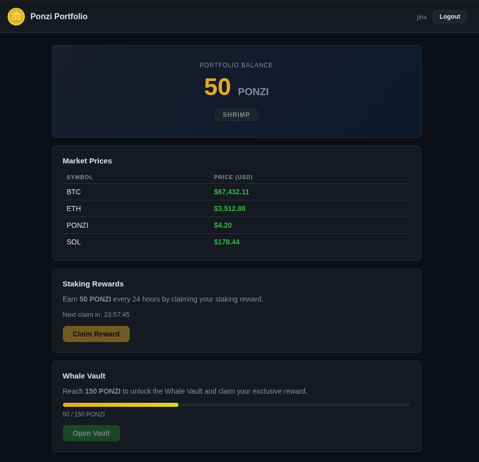
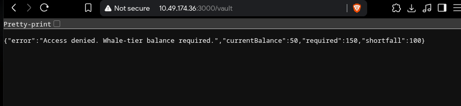
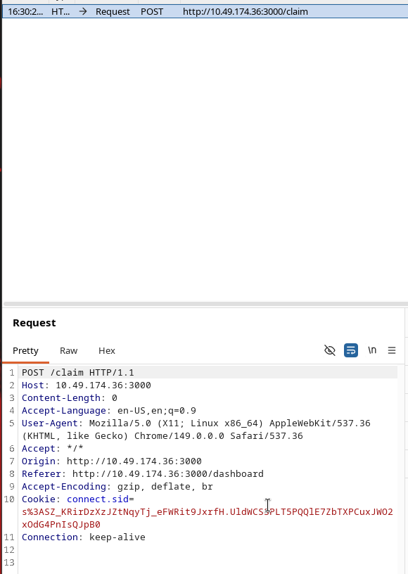
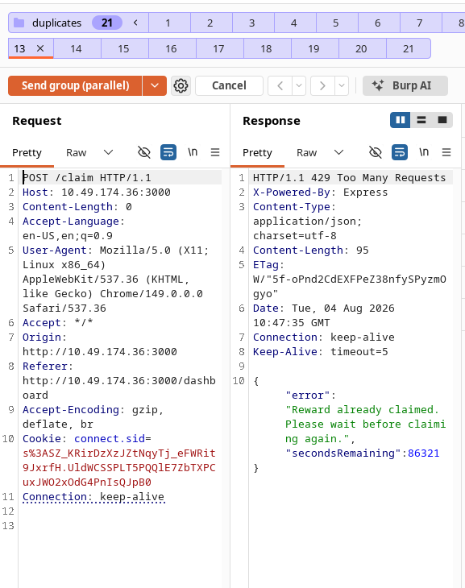
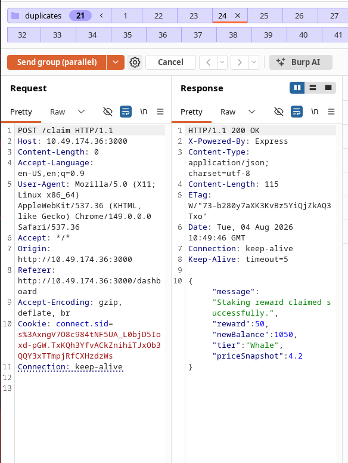
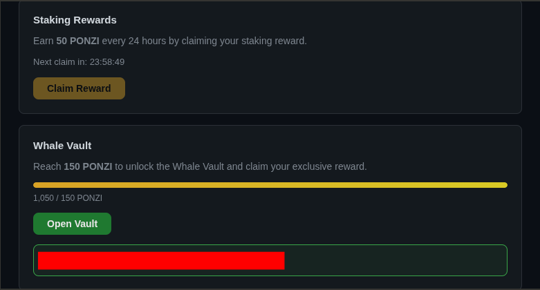

# Day 8 — Towel on the Sunbed

**Category:** Web Exploitation
**Difficulty:** Medium
**Date completed:** 4th of August 2026

---

## Summary

The Ponzi Portfolio wellness rewards app (Node.js/Express) let guests claim 50 PONZI tokens every 24 hours via a `/claim` endpoint, gated by a server-side cooldown check. The endpoint's eligibility check and balance update weren't wrapped in an atomic transaction, creating a classic TOCTOU (time-of-check-to-time-of-use) race condition. Firing dozens of concurrent claim requests at a fresh account let multiple requests read the same "no prior claim" state before any of them finished writing the cooldown, allowing 21 rewards to be credited in a single burst instead of one. This pushed the account from Shrimp tier straight to Whale tier (1,050/150 PONZI), unlocking the Whale Vault and its flag.

---

### Step 1: Recon

```bash
nmap -sCV 10.49.174.36
```

Results showed:
- `22/tcp` - OpenSSH 9.6p1 (Ubuntu)
- `3000/tcp` - Node.js Express app, page titled "Ponzi Portfolio - Login"

```bash
ffuf -u http://10.49.174.36:3000/FUZZ -w /usr/share/seclists/Discovery/Web-Content/common.txt
```

Found:
- `/dashboard` - 401 (exists, needs auth)
- `/vault` - 401 (exists, needs auth)
- `/css`, `/js` - static assets

---

### Step 2: Explore the reward mechanism

Registered a guest account and logged into the dashboard. Starting state:
- Balance: **0/150 PONZI**, tier: **Shrimp**
- **Claim Reward** button grants **+50 PONZI**, then starts a 24h cooldown ("Next claim in: 23:57:45")
- **Whale Vault** section requires **150 PONZI** to unlock



Hitting `/vault` directly while under threshold returned:

```json
{"error":"Access denied. Whale-tier balance required.","currentBalance":50,"required":150,"shortfall":100}
```



This confirmed the vault check was purely balance-based server-side, with nothing else gating access.

---

### Step 3: Capture the claim request

Using Burp Suite's browser, clicked Claim Reward and captured the request:

```
POST /claim HTTP/1.1
Host: 10.49.174.36:3000
Content-Length: 0
Cookie: connect.sid=<session>
```



No body - a bare authenticated `POST`. All claim eligibility and reward logic was resolved entirely server-side from the session's cooldown state.

---

### Step 4: Identify the race condition

The claim endpoint almost certainly followed this pattern:

```
1. Read user's lastClaimTimestamp
2. If (now - lastClaimTimestamp < 24h) → reject
3. Else → credit +50 PONZI, update lastClaimTimestamp
```

If steps 1–3 aren't wrapped in an atomic transaction or row lock, firing many `/claim` requests concurrently lets multiple of them read the same stale `lastClaimTimestamp` before any single request finishes writing the update - crediting multiple rewards in one window.

---

### Step 5: First attempt - control test (failed as expected)

Grouped 21 duplicate `/claim` requests in Burp Repeater and used **Send group in parallel**, but against an account that had already claimed once. Every response came back identical:

```json
{"error":"Reward already claimed. Please wait before claiming again.","secondsRemaining":86321}
```



This proved nothing on its own - all 21 requests hit an already-locked cooldown simultaneously. The race window only exists on the **first-ever claim** for an account, before any cooldown record exists yet.

---

### Step 6: Second attempt - racing the first claim

- Registered a fresh guest account
- Logged in without touching Claim Reward manually
- Loaded the `/claim` request into Burp Repeater with the new account's session cookie
- Duplicated into 41 parallel tabs, grouped them
- **Send group (parallel)** - Burp's single-packet technique releases all requests within the same TCP window, landing them on the server near-simultaneously

Result from one of the winning requests:

```json
{
  "message": "Staking reward claimed successfully.",
  "reward": 50,
  "newBalance": 1050,
  "tier": "Whale",
  "priceSnapshot": 4.2
}
```



**21 of the 41 requests won the race** (21 × 50 = 1,050 PONZI), instantly crossing the 150 threshold and flipping the account to Whale tier server-side.

---

### Step 7: Open the vault

Reloaded the dashboard, now showing:

```
Whale Vault
1,050 / 150 PONZI
[Open Vault]
```

Clicking **Open Vault** returned the flag:

```
THM{[REDACTED]}
```



---

## Why this worked

The 24h cooldown was only ever a *time check*, not a concurrency guard. The server read the last-claim timestamp, decided whether enough time had passed, and only wrote the new timestamp afterward - three separate steps with no lock or transaction tying them together. Under normal single-request usage that sequence is invisible; nothing ever races it. But nothing stopped forty-one requests from hitting step 1 at almost the same instant, all reading the same "never claimed" state, all deciding independently that they were allowed to proceed, and all writing a reward before any of them got around to writing the cooldown that should have blocked the rest.

It's the same failure mode as classic TOCTOU bugs in file systems or payment systems, just moved into a rewards endpoint: the check and the use of that check are two different moments in time, and anything that can happen in between is fair game. Burp's parallel-send existed specifically to shrink that "in between" down to something exploitable - network jitter normally spreads requests out enough that a race like this stays theoretical, but firing them in the same TCP window collapses that gap.

@0xMia's throwaway comment was the whole hint: the clock was never the real gate, it just looked like one.

---

## Lessons Learned

- Any "claim once per interval" logic needs an atomic check-and-update, not a read followed by a separate write. A conditional atomic update (`UPDATE ... SET balance = balance + 50, lastClaim = NOW() WHERE lastClaim < NOW() - INTERVAL 24 HOUR`) or a `SELECT ... FOR UPDATE` closes this gap entirely.
- Rate-limiting per-account concurrent requests at the application or gateway layer is a cheap second line of defense, even if the DB layer is fixed.
- Burp's "send group in parallel" (single-packet attack) is worth reaching for any time an app has a "once per X" action - cooldowns, one-time codes, limited-stock purchases, coupon redemption - since these are exactly the endpoints most likely to have unguarded check-then-write logic.
- A control test against an already-cooled-down account is a useful sanity check before assuming a race failed - the account state matters as much as the request timing.
- Business logic bugs don't need any injection or memory corruption to be dangerous; a race condition in a rewards system is a full authorization bypass on its own.
